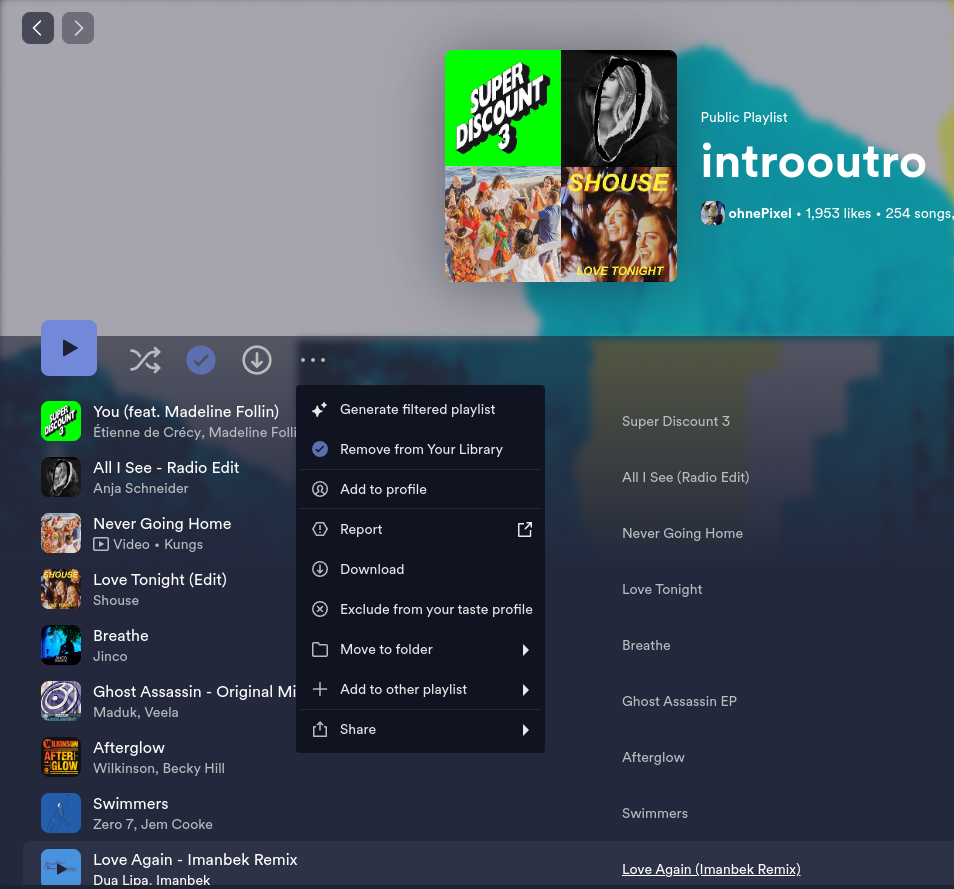
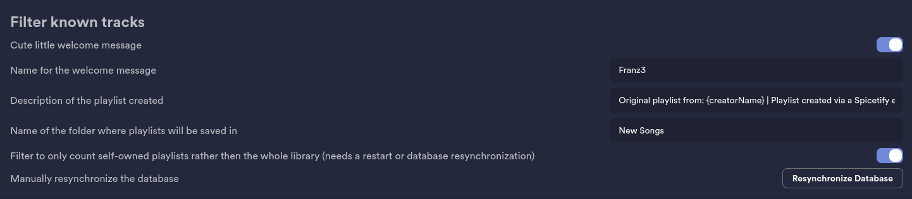

## Function:

Creates a new playlist which only contains songs of a playlist that are not in your Spotify library

- compares tracks from another playlist with your own library based on the isrc or uri as fallback
- if used on self-owned playlist it compares based on the uri instead of isrc
- needs to synchronize your Spotify library on startup, before it can be used
- puts the newly created playlist in a folder that's in your root directory
- copy's image and name of the old playlist and mention the user who created the old playlist in the description

It took ~12 minutes 30 seconds for a playlist with ~5600 tracks, where ~5360 were new tracks, to finish

Original playlist:

Newly created playlist:

## Settings:

- custom welcome message which is toggleable
- custom playlist description with the possibility of using the name of the original creator
- custom name for the folder where all playlists are saved too
- toggle between all playlists in your library vs only the playlists you own (this includes collaborative playlists)
- ability to resynchronize the database manually to not having to reboot

## ToDo:

#### Features

- custom compare instead of isrc (compare using title, artists and duration)
- add blacklist for songs
- add blacklist and whitelist for playlists
- add option to make/ compare playlist with tracks that are in your library to find tracks in common
- auto skip if track is in users library

#### Improve code

- restructure code to have the things we expect first, and not the edge cases
- add utils class for map to handle everything map related
- use Error instead of undefined/ null
- make functions smaller and thereby easier to test and modify

## Known bugs:

## Commands:

``npm run build``

``spicetify apply``

``npm run watch``

``spicetify watch -le``

## Useful Links:

https://dexie.org/docs/Typescript

https://developer.spotify.com/documentation/web-api/reference/get-track

https://spicetify.app/docs/development/api-wrapper/methods/cosmos-async

https://github.com/spicetify/spicetify-marketplace/wiki/Publishing-to-Marketplace

https://github.com/FlafyDev/spicetify-creator-plugins/tree/main/packages/spcr-settings

## Credit's:

- [vinyl image](https://unsplash.com/photos/assorted-books-on-red-plastic-crate-f8MLY_HKwqQ)
#### Helpful people
- [Delusoire](https://github.com/Delusoire)
- [Resxt](https://github.com/Resxt)
- [ririxi](https://github.com/rxri)
- [SoCalifornian](https://github.com/surfbryce)
- [charlieS](https://github.com/CharlieS1103)
- [mark](https://github.com/machinemessiah)